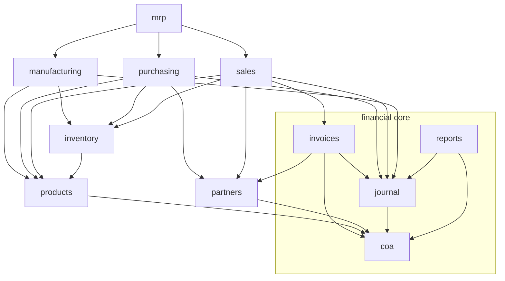
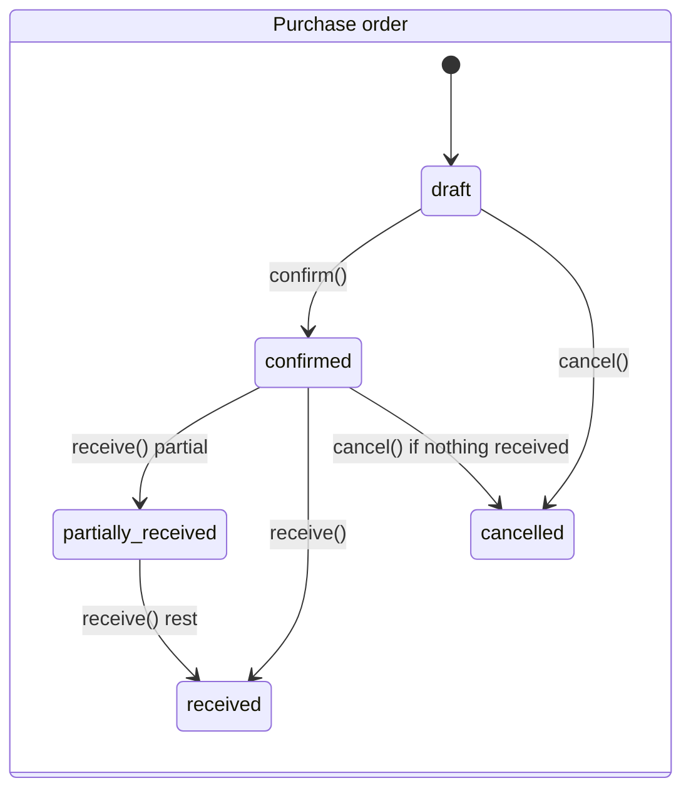
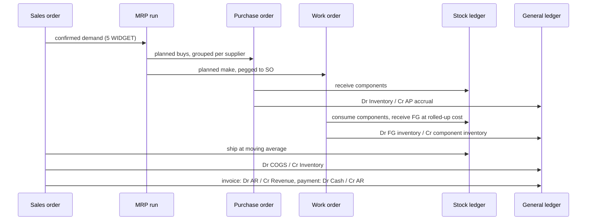

# DjangoERP architecture

DjangoERP is built outward from a double-entry accounting core into a modular ERP with end-to-end order-to-cash, procure-to-pay and make-to-stock processing plus a bare-minimum-but-credible MRP planning engine. This document maps the modules, the invariants that hold the system together, the GL posting matrix, the planning algorithm, and the open-source systems whose designs were deliberately adopted.

## Module map and dependency direction

Modules depend downward only (Tryton's decomposition discipline): master data knows nothing about documents, documents know nothing about planning, and the ledgers (`journal`, `inventory`) are written through services, never directly.

| App | Owns | Depends on |
| --- | --- | --- |
| `core` | `TimestampMixin`, `DocumentSequence` (atomic numbering), `core.audit` (audit-trail writer), `core.demo` (demo company), `demo_erp` command | `accounts` (audit model) |
| `partners` | `BusinessPartner` — one row can be customer and/or supplier, carries AR/AP control accounts | `coa` |
| `products` | `UnitOfMeasure`, `ProductCategory` (GL account mappings), `Product` (buy/make, costs, lead time, safety stock, lot sizing) | `coa`, `partners` |
| `inventory` | `Warehouse`, `StockMove` (append-only stock ledger), `StockLevel` (cached on-hand + moving average) | `products` |
| `purchasing` | `PurchaseOrder`/`PurchaseOrderLine`, receipt flow | `partners`, `products`, `inventory`, `journal` |
| `sales` | `SalesOrder`/`SalesOrderLine`, shipment and invoicing flow | `partners`, `products`, `inventory`, `invoices`, `journal` |
| `manufacturing` | `BillOfMaterials`/`BOMLine`, `WorkOrder`, completion flow | `products`, `inventory`, `journal` |
| `mrp` | `MRPRun`, `PlannedOrder`, the planning engine and plan-to-order conversion | everything above |

## The invariants

The two ledgers follow the same law: **only posted rows exist**. Journal entries count only when `status='posted'`; stock moves count only when `status='done'`. Both are append-only — corrections are reversing entries and opposing moves, never edits. The API enforces this: posted journal entries reject every change except voiding, completed stock moves reject all changes, posted invoices and payments reject edits.

Cached balances are derived, provably. `StockLevel` is the cache of `SUM(done moves)` per product/warehouse, maintained under `select_for_update` row locks in the same transaction as the move, and `inventory.services.rebuild_stock_levels()` reconstructs it from the ledger (pinned by test).

Documents are state machines. Every transition — `confirm`, `receive`, `ship`, `complete`, `post`, `convert`, `cancel` — is a named service function that validates preconditions, does all its work in one transaction, and writes the audit trail. Views and serializers never assign `status` directly.

Posting is idempotent. `JournalEntry.source_reference` is unique; every system posting is keyed to its business event (`grn:GRN-00001`, `shipment:SHP-00001`, `wo:WO-00001:complete`, `invoice:INV-00001`, `payment:PAY-00001`), so a retried flow returns the existing entry instead of double-posting.

Stock is valued at moving average, per product per warehouse (ERPNext's formula): receipts re-weight `average_cost = (old_qty*old_avg + receipt_value) / new_qty`; issues leave at the current average and can never drive on-hand negative. Every completed move snapshots `unit_cost` and the 2dp `total_value` its GL posting used, so the stock ledger and the general ledger cannot disagree.

Decimal everywhere: quantities are `Decimal(12,3)`, unit costs/prices `Decimal(12,4)`, monetary document totals 2dp, and the journal keeps its wider `20,2` lines. GL amounts are quantized to the cent before posting.

## Document lifecycles

Sales orders mirror this (`draft -> confirmed -> partially_shipped -> shipped -> invoiced`), work orders run `draft -> confirmed -> in_progress -> completed`, and MRP runs follow the async report pattern (`pending -> running -> completed | failed`). Planned orders promote `planned -> converted` (frePPLe's proposal ladder) or are cancelled.

## GL posting matrix

Account resolution is explicit configuration, never guessed: product categories carry `inventory_account`, `revenue_account`, `cogs_account`; partners carry `receivable_account` / `payable_account`; payments carry a `deposit_account`; posting raises a configuration error naming the missing account.

| Business event | Debit | Credit | Source |
| --- | --- | --- | --- |
| Goods receipt (GRN) | Inventory (per product category), at PO price | Supplier payable (accrual) | `purchasing.services.receive_purchase_order` |
| Work order completion | Inventory of finished good, at rolled-up component value | Inventory of components, at moving average | `manufacturing.services.complete_work_order` |
| Shipment | COGS (per category), at moving average | Inventory (per category) | `sales.services.ship_sales_order` |
| Customer invoice posted | Partner receivable | Revenue (per line product category, or invoice fallback account) | `invoices.services.post_invoice` |
| Customer payment posted | Deposit (cash/bank) account | Partner receivable | `invoices.services.post_payment` |
| Supplier settlement | Supplier payable | Cash | manual journal entry (vendor-bill matching is roadmap) |

Revenue recognition is deliberately split from shipment: shipping posts COGS only, and revenue posts when the invoice posts, keeping the two events separately auditable.

## The MRP engine

`mrp.engine` implements classic regenerative, level-by-level (Orlicky) MRP I — the textbook algorithm none of the surveyed systems implements quite this directly:

1. **Low-level codes** are computed over the active-BOM graph (components sit strictly below every parent), so each product is netted exactly once, after all demand on it is known.
2. **Demand**: open confirmed sales-order lines (due at `requested_date`), component requirements of open work orders, safety-stock top-ups, and — during the run — component demand exploded from planned make orders at their release dates.
3. **Supply**: on-hand stock, open confirmed purchase-order line quantities, open work-order quantities.
4. **Netting** allocates available supply to demand in due-date order; each shortfall becomes a `PlannedOrder` sized by the product's lot policy (lot-for-lot, floored to `min_order_qty`, rounded up to `order_multiple`).
5. **Lead-time offsetting**: release date = due date − `lead_time_days`; releases landing before the run's `as_of_date` are clamped and flagged `expedited`.
6. **Pegging**: every planned order records the demand element it covers (`demand_reference`) and, for exploded requirements, the parent planned order — a where-used trail from a raw-material buy back to the customer order.
7. **Conversion** (a separate, deliberate action) groups buy proposals into one draft purchase order per supplier and creates one draft work order per make proposal. Drafts are invisible to the next run until confirmed — planning proposes, people commit.

Capacity is assumed infinite (no routings/work centers), buckets are continuous dates, and the plan is regenerative per run. Those are the standard MRP I simplifications; the upgrade paths are listed in the roadmap.

## End-to-end demonstration

`python manage.py demo_erp` runs the whole loop through the same services the API uses and fails non-zero if the books do not balance:

The same flow is pinned with exact numbers by `core/tests.py::EndToEndERPFlowTests`, which ends by asserting the trial balance foots, the balance sheet balances with current-period earnings folded into equity, net income equals revenue minus COGS, the audit trail recorded every transition, and a second regenerative MRP run plans nothing because the first cycle satisfied all demand.

## Open-source designs adopted, and licensing

Per the consolidation research (source-verified against each project), these patterns were adopted — as re-implemented designs, not copied code. ERPNext (GPL-3), Odoo (LGPL-3), Tryton (GPL-3) and frePPLe (AGPL-3) are copyleft: ideas, schemas, formulas and state charts are fair game, their code is not, and none was copied. InvenTree (MIT) would be safe to copy from; its patterns were used as the floor reference.

| Adopted here | Pattern source |
| --- | --- |
| Append-only signed stock ledger + cached per-warehouse level | ERPNext Stock Ledger Entry + Bin; Odoo `stock.move` + `stock.quant` split |
| Moving-average formula per product/warehouse | ERPNext `stock_ledger.py` (re-derived) |
| Document numbering via a sequence table (`DocumentSequence`) | ERPNext naming series; `django-sequences` (BSD) is the drop-in library alternative if gapless multi-process numbering ever needs hardening |
| One partner with customer/supplier flags | Odoo/Tryton party model |
| Line-level fulfillment counters (`received_quantity`, `shipped_quantity`) | Odoo `qty_received` / `qty_delivered` |
| Named transition services as the only status writers | Tryton `@Workflow.transition` discipline |
| GL account defaults on product category and partner | ERPNext item-group / party defaults |
| Planned-order promotion ladder and expedite flags | frePPLe operationplan lifecycle |
| Supplier-grouped conversion of planned buys | Odoo vendor merge |
| Lot sizing (`min_order_qty` + `order_multiple`) | Odoo orderpoint rounding, frePPLe size_minimum/multiple |
| No negative stock, no backdated repost | ERPNext's largest complexity (its repost subsystem), removed by constraint |

Library survey (all MIT/BSD/Apache, safe here): `django-sequences` (numbering), `django-fsm-2` (transition sugar), `django-simple-history` / `django-auditlog` (row history). The core keeps zero new runtime dependencies — the audit requirement is met by wiring the existing `accounts.AuditLog` through `core.audit.log_event` from every service transition, and transitions are enforced by plain guarded functions.

## Deliberate exclusions (roadmap)

Each exclusion names the reference system that shows the upgrade path: routings/work centers and finite capacity (frePPLe), WIP staging warehouse and job cards (ERPNext), vendor-bill three-way match against the GRN accrual (classic GR/IR), stock reservations (Odoo `reserved_quantity`), UoM conversion rings (ERPNext `conversion_factor` idiom), product variants (all systems — their biggest accidental complexity, deliberately absent), lot/serial tracking, multi-currency, backdated valuation repost, BOM component snapshots on work orders, credit notes, and per-location bins. The EDGAR/XBRL module remains a later consolidation pass per the README roadmap.
